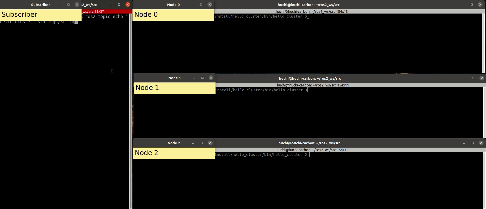

# FOROS : Failover ROS framework

[](https://opensource.org/licenses/Apache-2.0)
[](https://build.ros2.org/job/Gdev__foros__ubuntu_focal_amd64/)
[](https://build.ros2.org/job/Gdev__foros__ubuntu_focal_amd64/)
[](https://scan.coverity.com/projects/foros)

## Purpose
FOROS is a [ROS2](https://docs.ros.org/en/galactic/index.html) framework that provides the ability to construct a active-standby cluster  based on the [RAFT](https://raft.github.io/) consensus algorithm.

### Key Features
| Feature           | Description                                                              |
| ----------------- | ------------------------------------------------------------------------ |
| Node Redundancy   | Maintain a cluster of nodes runing in parallel to acheive a common goal. |
| State Replication | Replicate a state of nodes for implementing a fault-tolerant service.    |

### Goals
This framework can tolerate fail-stop failures equal to the cluster size minus the quorum.
| Cluster size (N) | Quorum (Q = N / 2 + 1) | Number of fault tolerant nodes (N - Q) |
| :--------------: | :--------------------: | :------------------------------------: |
|        1         |           1            |                 **0**                  |
|        2         |           2            |                 **0**                  |
|        3         |           2            |                 **1**                  |
|        4         |           3            |                 **1**                  |
|        5         |           3            |                 **2**                  |

## Prerequisites (Ubuntu)
### Install ROS2
Supported distributions
| OS           | Distribution                                  | Foros branch |
| ------------ | --------------------------------------------- | ------------ |
| Ubuntu 20.04 | [galactic](https://docs.ros.org/en/galactic/) | galactic     |
| Ubuntu 22.04 | [humble](https://docs.ros.org/en/humble/)     | humble       |

### Install leveldb, ncurses
```bash
sudo apt install libleveldb-dev libncurses-dev
```

## Build
> If you want to install to existing ROS2 workspace, please clone this source in the workspace in advance.

```bash
. /opt/ros/galactic/setup.bash
colcon build
```

## Getting Started

In this section, we will create a cluster of 3 nodes that publishes a node ID every second.
Lets' assume that,
|  Cluster Name   | Cluster Size | Node IDs in the Cluster |   Topic Name    |
| :-------------: | :----------: | :---------------------: | :-------------: |
| "hello_cluster" |      3       |         0, 1, 2         | "hello_cluster" |

### 1) Setup Environment
```bash
. /opt/ros/galactic/setup.bash
# If foros is installed in the custom workspace,
. {custom workspace}/install/setup.bash
```

### 2) Create ROS2 package
Let's create the hello_cluster package that depends on foros, rclcpp, and std_msgs.

```bash
ros2 pkg create hello_cluster --description "Hello Cluster" --build-type ament_cmake --dependencies foros rclcpp std_msgs
```

### 3) Create "src/hello_cluster.cpp"
Most of the code is the same as the general ros2 code, except that the `akit::failover::foros::ClusterNode` class is used instead of `rclcpp::Node` when creating a node.
Unlike `rclcpp::Node` that receives a node name as an argument, `akit::failover::foros::ClusterNode` receives a cluster name, node ID, and IDs of all nodes in the cluster as arguments. In fact, the node name of a cluster node is internally created by combining the cluster name and node ID. 
> For instance, if cluster name is "hello_cluster" and node id is 0, node name is created as "hello_cluster0"

```cpp
// hello-cluster.cpp
#include <chrono>
#include <rclcpp/rclcpp.hpp>
#include <std_msgs/msg/string.hpp>
#include <string>
#include <vector>

#include "akit/failover/foros/cluster_node.hpp"

using namespace std::chrono_literals;

int main(int argc, char **argv) {
  const std::string kClusterName = "hello_cluster";
  const std::string kTopicName = "hello_cluster";
  const std::vector<uint32_t> kClusterNodeIds = {0, 1, 2};

  rclcpp::Logger logger = rclcpp::get_logger(argv[0]);
  logger.set_level(rclcpp::Logger::Level::Info);

  if (argc < 2) {
    RCLCPP_ERROR(logger, "Usage : %s {node ID} {size of cluster}", argv[0]);
    return -1;
  }

  uint32_t id = std::stoul(argv[1]);
  if (find(kClusterNodeIds.begin(), kClusterNodeIds.end(), id) ==
      kClusterNodeIds.end()) {
    RCLCPP_ERROR(logger, "Node ID must be among 0, 1, 2");
    return -1;
  }

  rclcpp::init(argc, argv);

  // Create cluster node not rclcpp::Node
  auto node = akit::failover::foros::ClusterNode::make_shared(kClusterName, id,
                                                              kClusterNodeIds);

  auto publisher = node->create_publisher<std_msgs::msg::String>(kTopicName, 1);
  auto timer_ =
      rclcpp::create_timer(node, rclcpp::Clock::make_shared(), 1s, [&]() {
        auto msg = std_msgs::msg::String();
        msg.data = std::to_string(id);
        publisher->publish(msg);
      });
  rclcpp::spin(node->get_node_base_interface());
  rclcpp::shutdown();

  return 0;
}
```

### 4) Update "CMakeLists.txt"
Add below code to CMakeLists.txt
```cmake
# Add "hello_cluster" exectuable target
add_executable(${PROJECT_NAME} src/hello_cluster.cpp)
# Add dependencies
ament_target_dependencies(${PROJECT_NAME}
  foros
  rclcpp
  std_msgs
)
# Install
install(
  TARGETS ${PROJECT_NAME} EXPORT ${PROJECT_NAME}
  DESTINATION lib/${PROJECT_NAME}
)
```

### 5) Build
```bash
# in the workspace,
colcon build --symlink-install
```

### 6) Test
Prior to run the nodes, let's subscribe to "hello_cluster" topic using ros2 command.
```bash
# Subscriber
ros2 topic echo "hello_cluster" std_msgs/String
```

If you run node 0, node 1, and node 2,
```bash
# Node 0
ros2 run hello_cluster hello_cluster 0
```
```bash
# Node 1
ros2 run hello_cluster hello_cluster 1
```
```bash
# Node 2
ros2 run hello_cluster hello_cluster 2
```

One node (0) became the leader, and it starts to publish mesage to topic.
```bash
# Subscriber
## Assume that new leader is node 0
---
data: '0'
---
data: '0'
---
...
```

When leader node (0) is terminated, one node (1) becomes the leader and starts publishing messages.
```bash
# Subscriber
## Assume that new leader is node 1
---
data: '1'
---
data: '1'
---
...
```

When leader node (1) is terminated, the number of terminated nodes has exceeded fault tolerance and the remaining node (2) has failed to become leader.
```bash
# Subscriber
## No output since there is no leader
```

Restarting node (1) causes one node (2) to become the leader and start publishing messages.
```bash
# Subscriber
## Assume that new leader is node 2
---
data: '2'
---
data: '2'
---
...
```

You can also check the cluster status with the [inspector tool](docs/inspector.md) as shown below.


