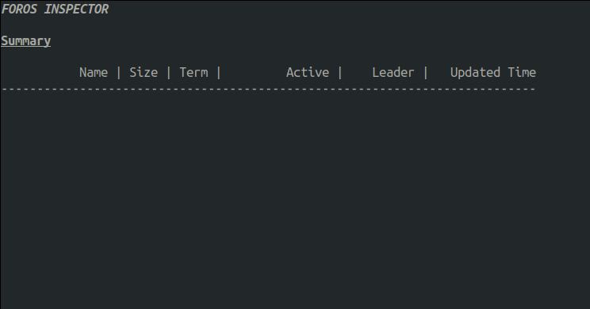

# FOROS Inspector

Inspector is a tool for monitoring the status of a FOROS cluster. You can check the active cluster information and the information of the nodes within the cluster.

## How to use
### 1) Setup Environment
```bash
. /opt/ros/galactic/setup.bash
```

If foros is installed in the custom workspace,
```bash
. {custom workspace}/install/setup.bash
```

### 2) Enable Inspector
Only ROS nodes running in the environment where environment variable `FOROS_INSPECTOR` is set to `1` can be monitored.

```bash
export FOROS_INSPECTOR=1
```

If you want to change monitoring period, (default 1s)
```bash
# 500ms
export FOROS_INSPECTOR_PERIOD=0.5
```

### 3) Run Inspector
```bash
ros2 run foros_inspector foros_inspector
```

### 4) Sample Output

